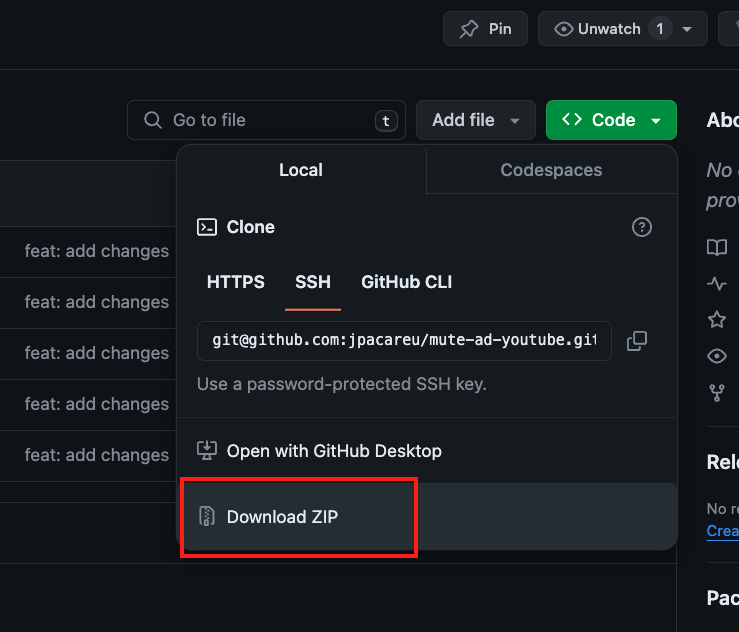
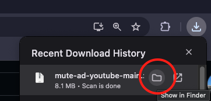
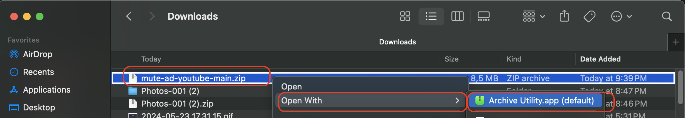
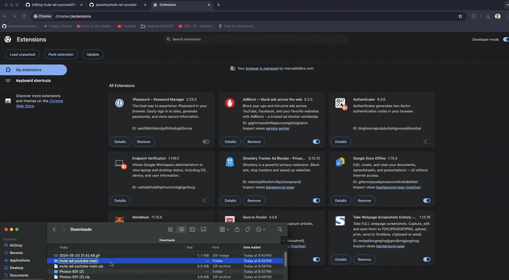

# Mute Ad Youtube

## Description

This Chrome extension automatically mutes advertisements and displays a completely black screen whenever a YouTube ad pops. Enjoy "uninterrupted" viewing without the distraction of ads.

## Demo

## Install

### Step 1: Download the extension from the github repository.

### Step 2: Open the file in the "Downloads" folder.

### Step 3: Extract the file `.zip` file.

### Step 4: Open the Chrome browser and go to the extensions page ([chrome://extensions/](chrome://extensions/)) and drag the folder to the "Extensions" tab.

